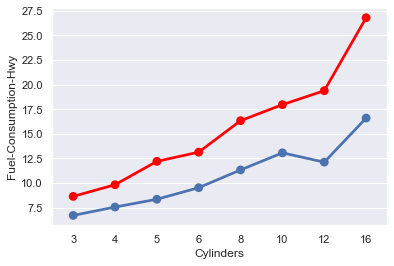
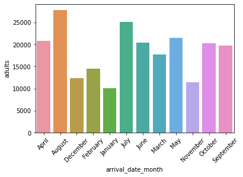

# Data Visualization

PR: https://github.com/moayadalhaj/data-visualization/pull/1

## First dataset for fuel consumption

From this data I analyse these data by groub it to get the relation between different features.
then I visualizate the data:

- More Engine size the car have, more CO2 emission it will produce.

- For the fuel consumption, the best cars are the 4-cylinders cars, that relates to the continuous development in the 4-cylinders cars (the massive production of these cars, compared to all other cars combined)

- The fuel consumption when the car travel in highway is less than the car travel within the city

## second dataset for Hotel booking

After analyse the data and visulization

- The number of adults that bokking hotels in 2016 is the maximmum
- The maximmum nuber of adults was on august then in july.

